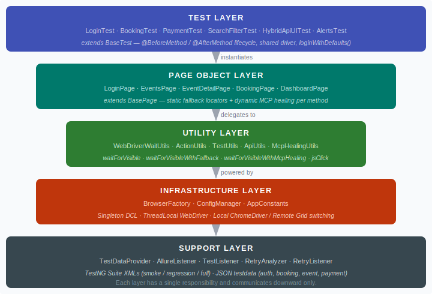
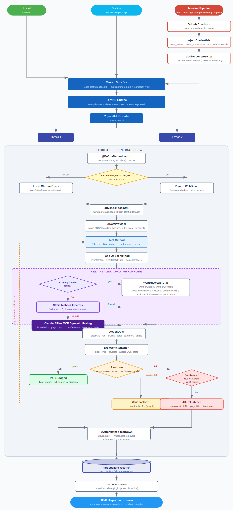
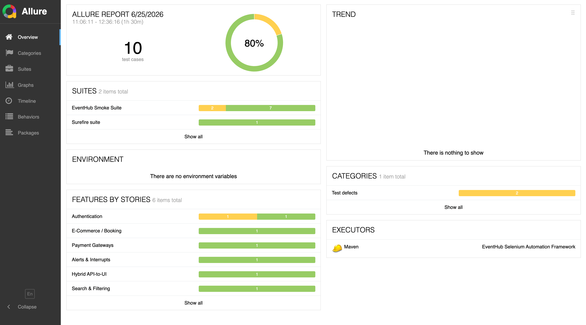
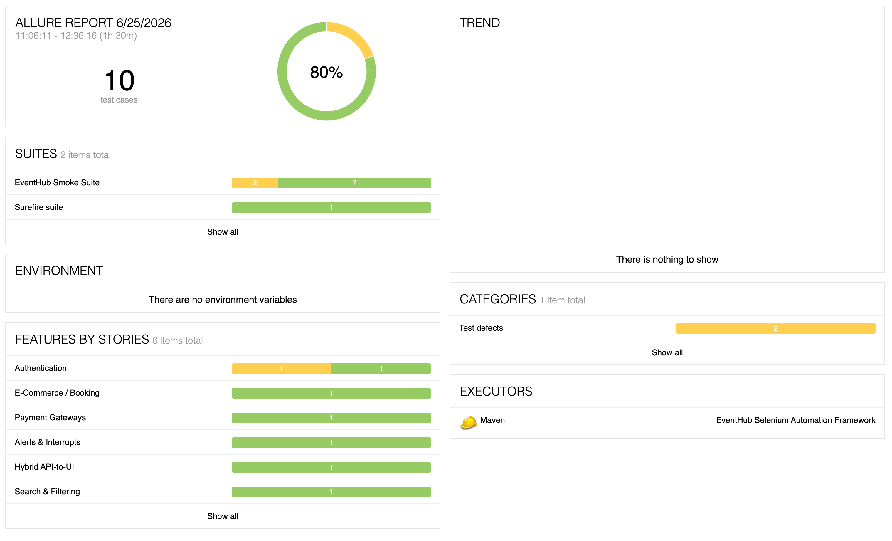
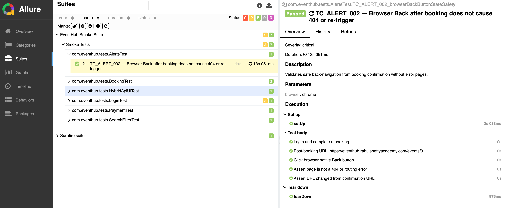

# Selenium Automation Framework


A multi-layered UI + API test automation framework** built in Java for the
[EventHub](https://eventhub.rahulshettyacademy.com) web application. The framework demonstrates software design patterns, parallel thread-safe execution,
hybrid API-to-UI testing, self-healing locator fallback, automatic retry logic, and full Docker
containerisation with Allure reporting.

---

## Table of Contents

- [Architecture](#architecture)
- [Design Patterns](#design-patterns)
- [Technology Stack](#technology-stack)
- [Tools & Plugins](#tools--plugins)
- [Test Coverage](#test-coverage)
- [Project Structure](#project-structure)
- [Quick Start](#quick-start)
- [Docker — Headless Execution](#docker--headless-execution)
- [Jenkins CI Pipeline](#jenkins-ci-pipeline)
- [Allure Report](#allure-report)
- [Credential Setup](#credential-setup)

---

## Architecture

The framework is organised into five distinct, loosely coupled layers. Each layer has a single
responsibility and communicates downward only.



### End-to-End Workflow



---

## Design Patterns

This framework applies **9 software design patterns**. Each one solves a specific engineering
problem — here is what each pattern does, why it was chosen, and where it lives in the code.

---

### 1. Page Object Model (POM)

**The fundamental pattern of the entire framework.**

Every screen of the application is represented by a dedicated Java class that owns the element
locators and exposes readable, intent-driven methods. Test code never contains CSS selectors or
XPath — it only speaks in business terms.

```
// Without POM — brittle, unreadable:
driver.findElement(By.id("email")).sendKeys(email);
driver.findElement(By.id("login-btn")).click();

// With POM — readable, maintainable:
LoginPage loginPage = new LoginPage(driver);
DashboardPage dashboard = loginPage.login(email, password);
```

**Benefit:** When a button's `id` changes in production, only the page class changes — not a
single test method.

**Lives in:** `src/main/java/com/eventhub/pages/`

---

### 2. Singleton Pattern with Double-Checked Locking (DCL)

**Ensures exactly one instance exists across all threads.**

```java
private static volatile BrowserFactory instance;

public static BrowserFactory getInstance() {
    if (instance == null) {                   // first check — no lock overhead once initialised
        synchronized (BrowserFactory.class) {
            if (instance == null) {           // second check — prevents race on first init
                instance = new BrowserFactory();
            }
        }
    }
    return instance;
}
```

The `volatile` keyword forces a JVM memory barrier — a second thread cannot observe a
partially-constructed object even on modern multi-core CPUs with reordered memory writes.

**Lives in:** `BrowserFactory`, `ConfigManager`

---

### 3. ThreadLocal Pattern

**Gives every parallel test thread its own isolated WebDriver — the key to safe parallelism.**

```java
private static final ThreadLocal<WebDriver> driverHolder = new ThreadLocal<>();

// Thread A → stores its own ChromeDriver
// Thread B → stores its own ChromeDriver
// Thread A calls getDriver() → gets only Thread A's driver, never Thread B's
```

Without ThreadLocal, two parallel tests would share one browser. Clicks from Test A would land on
whatever page Test B had navigated to — causing cascading random failures. ThreadLocal makes
parallel execution as reliable as serial.

**Lives in:** `BrowserFactory.driverHolder`

---

### 4. Factory Pattern

**Hides browser-creation complexity behind a single method.**

```java
WebDriver driver = switch (browser.toLowerCase()) {
    case "firefox" -> new FirefoxDriver(new FirefoxOptions());
    case "edge"    -> new EdgeDriver(new EdgeOptions());
    default        -> new ChromeDriver(buildChromeOptions());
};
```

The Docker path extends this further: when `SELENIUM_REMOTE_URL` is set, the factory
transparently returns a `RemoteWebDriver` instead of a local driver. Every caller receives
`WebDriver` — they never know the concrete type.

**Lives in:** `BrowserFactory.initDriver()`

---

### 5. Template Method Pattern

**Defines the test lifecycle skeleton once; subclasses fill in the test-specific steps.**

```
BaseTest.setUp()           ← @BeforeMethod — always runs: browser up, navigate to app
    YourTest.testMethod()  ← subclass fills in: find elements, click, assert
BaseTest.tearDown()        ← @AfterMethod(alwaysRun=true) — always runs: browser quit
```

`alwaysRun = true` means tearDown fires even when a test throws — no leaked Chrome processes
regardless of what happens in the test body.

**Lives in:** `BaseTest` → all 10 concrete test classes

---

### 6. Facade Pattern

**Hides multi-class complexity behind a clean, simple interface.**

`BasePage` is a facade over `WebDriverWaitUtils` and `ActionUtils`. Page classes call single-line
delegates without knowing which utility handles the request:

```java
// Page class calls this — one line, no imports, no util qualification:
clearAndType(EMAIL_INPUT, email);

// Internally BasePage delegates → ActionUtils.clearAndType()
//   which calls → WebDriverWaitUtils.waitForClickable()
//     which calls → WebDriverWait.until(ExpectedConditions...)
```

`ApiUtils` is also a facade: a two-line `ApiUtils.post(path, body, token)` hides RestAssured's
base URI configuration, content-type headers, body serialisation, and auth header construction.

**Lives in:** `BasePage`, `ApiUtils`

---

### 7. Data Provider Pattern (Parameterised Testing)

**Separates test data from test logic entirely.**

All test inputs live in JSON files. `TestDataProvider` reads them with Jackson's `ObjectMapper`
and returns `Object[][]` that TestNG feeds to test methods as typed parameters. Adding a new test
card number requires only a JSON edit — no Java compilation needed.

```
payment-data.json  →  TestDataProvider.invalidCards()  →  PaymentTest.TC_PAYMENT_001(num, expiry, cvv)
auth-data.json     →  TestDataProvider.validLoginData() →  LoginTest.TC_AUTH_001(email, password)
```

**Lives in:** `TestDataProvider` + `src/test/resources/testdata/*.json`

---

### 8. Observer Pattern (Event Listeners)

**Test classes are completely unaware of screenshot capture or logging — listeners handle it.**

TestNG fires lifecycle events. `AllureListener` and `TestListener` observe them:

```
TestNG fires: onTestFailure(result)
  ├── AllureListener → takes screenshot → Allure.addAttachment(PNG)
  │                 → attaches browser URL, page title, stack trace
  └── TestListener  → log.error("FAIL testName 1234ms")
```

Test methods contain zero screenshot code. The entire evidence-collection infrastructure is
wired up externally through the TestNG `@Listeners` annotation on `BaseTest`.

**Lives in:** `AllureListener`, `TestListener`

---

### 9. Separation of Concerns — Wait / Action Split

**Each utility class has exactly one reason to change.**

| Class | Responsibility | Methods |
|---|---|---|
| `WebDriverWaitUtils` | Explicit waits only — poll until condition met | `waitForVisible`, `waitForClickable`, `waitForInvisibility`, `waitForText`, `waitForAllVisible` |
| `ActionUtils` | Browser side effects — state-changing operations | `jsClick`, `scrollToElement`, `clearAndType`, `switchToNewTab`, `getCurrentUrl`, `pause` |

Mixing waits and actions in one class previously made it hard to reason about what a method would
do. The split means each class has one reason to change: wait conditions evolve independently of
interaction strategies.

**Lives in:** `WebDriverWaitUtils`, `ActionUtils`

---

### 10. Retry & Self-Healing Pattern

**Smoke tests automatically retry on failure; locators degrade gracefully when the primary selector breaks.**

Two complementary mechanisms work together:

#### Automatic Retry (IAnnotationTransformer + IRetryAnalyzer)

`RetryListener` implements `IAnnotationTransformer` — TestNG calls it once per `@Test` method at
suite startup, before any test runs. It inspects every method's groups and wires in `RetryAnalyzer`
on anything tagged `smoke`. No `@Test` annotation needs to be changed.

```java
// RetryListener — runs at suite startup, not per test:
public void transform(ITestAnnotation annotation, ..., Method testMethod) {
    if (Arrays.asList(annotation.getGroups()).contains("smoke")) {
        annotation.setRetryAnalyzer(RetryAnalyzer.class);
    }
}

// RetryAnalyzer — called by TestNG after each failure:
public boolean retry(ITestResult result) {
    if (retryCount < MAX_RETRIES) {   // MAX_RETRIES = 2
        pause(BACKOFF_MS[retryCount]); // 1 000 ms, then 2 000 ms
        retryCount++;
        return true;   // TestNG re-runs the test
    }
    return false;      // exhausted — mark FAILED
}
```

All 6 smoke tests are covered automatically. A clean run reports exactly **6**. A run with flaky
failures may report more (each retry attempt is counted separately by TestNG).

#### Self-Healing Locators (waitForVisibleWithFallback)

`WebDriverWaitUtils.waitForVisibleWithFallback(primary, fallbacks...)` tries the primary locator
first. If it times out, it silently tries each fallback in order, logging a warning whenever a
fallback is used — making flaky locators visible without crashing the test.

```java
// DashboardPage — 3 locators for the navbar email (LoginTest TC_AUTH_001):
return waitForVisibleWithFallback(
    By.id("user-email-display"),                                  // primary: exact id
    By.cssSelector("[data-testid='user-email']"),                 // fallback 1: data-testid
    By.cssSelector("nav span[class*='email'], .navbar-email")     // fallback 2: structural CSS
).getText().trim();

// BookingPage — 3 locators for booking ID (BookingTest TC_BOOKING_001):
return waitForVisibleWithFallback(
    By.cssSelector("span[data-testid='booking-id']"),             // primary: data-testid
    By.cssSelector(".booking-id, span.booking-id"),               // fallback 1: class
    By.xpath("//div[@data-testid='booking-card']//span[contains(@class,'id')]") // fallback 2: xpath
).getText().trim();
```

`waitForClickableWithStaleRecovery(locator)` re-finds a stale element up to 3 times before
propagating the `StaleElementReferenceException` — handles React re-renders that invalidate DOM
references mid-interaction.

**Lives in:** `RetryAnalyzer`, `RetryListener`, `WebDriverWaitUtils`, `McpHealingUtils`, `DashboardPage`, `BookingPage`, `EventsPage`, `EventDetailPage`

#### How static self-healing works

Static self-healing is implemented in `waitForVisibleWithFallback(primary, fallback1, fallback2)`.
Locators are tried in priority order — no external call is ever made:

```
waitForVisibleWithFallback(
    By.id("user-email-display"),                       ← primary   (most specific, fastest)
    By.cssSelector("[data-testid='user-email']"),       ← fallback 1 (data-testid survives id rename)
    By.cssSelector("nav span[class*='email']")          ← fallback 2 (structural CSS, most permissive)
)
    ↓ primary found?  → return element immediately
    ↓ timed out       → try fallback 1
    ↓ timed out       → try fallback 2
    ↓ all fail        → throw original exception
```

The locators are ordered by specificity. If the app is refactored and `id="user-email-display"`
is renamed, the test survives because `[data-testid='user-email']` or the structural CSS will
still match. A warning is logged whenever a fallback is used, making drift visible without
failing the test.

#### How dynamic MCP healing works

Dynamic MCP healing is implemented in `waitForVisibleWithMcpHealing(description, primary, fallbacks...)`.
It adds a third tier — the Claude API — after all static locators have been exhausted:

```
waitForVisibleWithMcpHealing(
    "search text input for finding events by keyword",
    By.cssSelector("input[placeholder='Search events, venues…']"),  ← tier 1: primary
    By.cssSelector("input[type='search']"),                          ← tier 2: static fallback 1
    By.cssSelector("input[name='search'], input[name='q']")          ← tier 2: static fallback 2
)
    ↓ any tier 1/2 locator found?  → return element (no API call)
    ↓ all fail
    ↓ McpHealingUtils.healLocator(driver, description)
         → strips <head>, sends <body> HTML + description to Claude API (claude-haiku)
         → Claude responds: "CSS: input#event-search"   ← tier 3: dynamic heal
         → parse response → By.cssSelector("input#event-search")
         → waitForVisible(healedLocator) → return element
    ↓ healed locator also fails → throw original exception
```

The API is only called in a real breakage scenario. In normal test execution the primary locator
matches on tier 1 and no API cost is incurred. Setting `ANTHROPIC_API_KEY` enables the tier 3
fallback; without it, the method degrades gracefully back to static-only behaviour.

> **Caching:** `McpHealingUtils` stores healed locators in a `ConcurrentHashMap` keyed by element
> description. If two tests look for the same element in one JVM run, only the first triggers an
> API call — subsequent calls return the cached result instantly.

#### Smoke test resilience matrix

Every smoke test gets automatic retry. Self-healing and MCP healing are applied selectively
at the page-object level — the test methods themselves contain no healing code.

| Test | Retry (RetryAnalyzer) | Static Self-Healing (waitForVisibleWithFallback) | Dynamic MCP Healing (waitForVisibleWithMcpHealing) |
|---|:---:|:---:|:---:|
| TC_AUTH_001 — Login | ✅ | ✅ `DashboardPage.getDisplayedUserEmail()` — 3 locators for navbar email | — |
| TC_SEARCH_001 — Search | ✅ | — | ✅ `EventsPage.search()` — Claude derives search input selector |
| TC_BOOKING_001 — Booking | ✅ | ✅ `BookingPage.getFirstBookingId()` — 3 locators for booking ID span | — |
| TC_PAYMENT_001 — Payment | ✅ | — | ✅ `EventDetailPage.clickConfirmBtn()` — Claude derives confirm button |
| TC_ALERT_002 — Alerts | ✅ | — | — |
| TC_HYBRID_001 — Hybrid | ✅ | — | — |

---

## Technology Stack

| Layer | Technology | Version |
|---|---|---|
| Language | Java | 21 |
| Build & Dependency Management | Maven | 3.9+ |
| Browser Automation | Selenium WebDriver | 4.21.0 |
| Driver Binary Management | WebDriverManager | 5.9.2 |
| Test Runner & Parallelism | TestNG | 7.9.0 |
| API Testing (Hybrid Tests) | RestAssured | 5.3.2 |
| Test Reporting | Allure | 2.27.0 |
| JSON Test Data Parsing | Jackson Databind | 2.17.1 |
| Logging | SLF4J + Logback | 2.0.13 / 1.5.6 |
| Containerisation | Docker + Compose | 29+ / v5+ |
| ARM64 Selenium Grid | Seleniarm Standalone Chromium | latest |

---

## Tools & Plugins

### Maven Dependencies

| Dependency | Version | Scope | Purpose |
|---|---|---|---|
| `selenium-java` | 4.21.0 | compile | Core WebDriver API — browser control, element interaction |
| `webdrivermanager` | 5.9.2 | compile | Auto-downloads matching chromedriver/geckodriver binaries |
| `testng` | 7.9.0 | compile | Test runner — `@Test`, `@DataProvider`, parallelism, groups |
| `allure-testng` | 2.27.0 | compile | Allure–TestNG bridge — wires `@Step`, `@Epic`, `@Feature` annotations |
| `allure-java-commons` | 2.27.0 | compile | `Allure.addAttachment()` API used by `AllureListener` |
| `rest-assured` | 5.3.2 | compile | HTTP client for hybrid API tests (TC_HYBRID_001, TC_HYBRID_002) |
| `jackson-databind` | 2.17.1 | compile | JSON parsing — reads all `testdata/*.json` files |
| `lombok` | 1.18.38 | provided | Annotation processor — eliminates boilerplate (getters, constructors) |
| `logback-classic` | 1.5.6 | compile | SLF4J implementation — routes logs to console and rolling file |
| `slf4j-api` | 2.0.13 | compile | Logging facade used across all framework classes |

### Maven Plugins

| Plugin | Version | Purpose |
|---|---|---|
| `maven-compiler-plugin` | 3.13.0 | Compiles Java 21 source; wires in Lombok annotation processor |
| `maven-surefire-plugin` | 3.3.1 | Runs TestNG suites; reads `testng-${suite}.xml`; passes JVM `argLine` |
| `allure-maven` | 2.12.0 | `mvn allure:serve` / `mvn allure:report` — converts raw JSON to HTML report |

### External Tools

| Tool | Version | Install | Purpose |
|---|---|---|---|
| Java (Eclipse Temurin) | 21 | [adoptium.net](https://adoptium.net) | Runtime and compiler |
| Apache Maven | 3.9+ | `brew install maven` | Build, dependency management, test execution |
| Google Chrome | latest | [chrome](https://www.google.com/chrome) | Browser under test (local mode) |
| Docker Desktop | 4.x+ | [docker.com](https://www.docker.com/products/docker-desktop) | Headless containerised execution |
| Allure CLI *(optional)* | 2.27+ | `brew install allure` | Standalone report generation outside Maven |

### IDE & Developer Tooling

| Tool | Purpose |
|---|---|
| IntelliJ IDEA / VS Code | Primary IDE — both supported via standard Maven project structure |
| Logback (`logback-test.xml`) | CONSOLE appender at INFO; rolling FILE appender at DEBUG to `target/logs/selenium-tests.log` |
| WebDriverManager | Eliminates manual driver binary downloads — resolves the correct version at runtime |
| `.dockerignore` | Prevents `target/`, `.git/`, `.idea/` from bloating the Docker build context |
| `.gitignore` | Excludes credentials (`config.properties`, `auth-data.json`), build output, IDE files |

---

## Project Structure

```
selenium-java-project/
├── pom.xml                          Dependencies, plugins, suite property
├── Dockerfile                       Test runner image (Java 21 + Maven)
├── docker-compose.yml               Selenium Grid + test runner
├── .gitignore                       Excludes credentials & build artifacts
├── README.md
├── FRAMEWORK_DOCUMENTATION.md      Full deep-dive technical reference
└── src/
    ├── main/java/com/eventhub/
    │   ├── config/ConfigManager.java          Singleton config + env var override
    │   ├── constants/AppConstants.java        All paths, group names, timeouts
    │   ├── driver/BrowserFactory.java         DCL Singleton + ThreadLocal WebDriver
    │   ├── pages/
    │   │   ├── BasePage.java                  Abstract — wires utils, exposes delegates
    │   │   ├── LoginPage.java
    │   │   ├── DashboardPage.java
    │   │   ├── EventsPage.java
    │   │   ├── EventDetailPage.java
    │   │   ├── BookingPage.java
    │   │   ├── PaymentPage.java
    │   │   ├── ProfilePage.java
    │   │   ├── RegisterPage.java
    │   │   └── CreateEventPage.java
    │   └── utils/
    │       ├── WebDriverWaitUtils.java         Explicit waits + self-healing fallback
    │       ├── ActionUtils.java                All browser actions
    │       ├── ApiUtils.java                   RestAssured facade
    │       └── TestUtils.java                  Stateless helpers
    └── test/
        ├── java/com/eventhub/tests/
        │   ├── base/BaseTest.java              Template Method lifecycle
        │   ├── listeners/AllureListener.java   Observer — screenshot on failure
        │   ├── listeners/TestListener.java     Observer — structured logging
        │   ├── listeners/RetryListener.java    IAnnotationTransformer — wires retry onto smoke tests
        │   ├── listeners/RetryAnalyzer.java    IRetryAnalyzer — 2 retries, 1s/2s back-off
        │   ├── dataproviders/TestDataProvider.java  JSON → @DataProvider
        │   └── [10 test classes]
        └── resources/
            ├── config.properties.template      Safe template — fill in locally
            ├── testdata/
            │   ├── auth-data.json.template     Safe template — fill in locally
            │   ├── search-data.json
            │   ├── booking-data.json           attendees: booking / cancellation / navigation
            │   ├── payment-data.json
            │   ├── form-data.json
            │   └── event-data.json             API event creation template (TC_HYBRID_001)
            └── suites/
                ├── testng-full.xml             All 20 tests, parallel classes, 2 threads
                ├── testng-smoke.xml            6 critical tests, RetryListener registered
                └── testng-regression.xml
```

---

## Quick Start

### Prerequisites

- Java 21+
- Maven 3.9+
- Google Chrome (latest)

### 1. Clone and configure credentials

```bash
git clone <repo-url>
cd selenium-java-project

# Copy templates and fill in your EventHub account credentials
cp src/test/resources/config.properties.template src/test/resources/config.properties
cp src/test/resources/testdata/auth-data.json.template src/test/resources/testdata/auth-data.json

# Edit both files — replace YOUR_EMAIL_HERE and YOUR_PASSWORD_HERE
```

### 2. Run tests

```bash
# Full regression suite (Chrome, browser opens on screen)
mvn test

# Smoke suite only — 6 critical tests (with auto-retry on failure)
mvn test -Dsuite=smoke

# Firefox
mvn test -Dbrowser=firefox

# Single test class
mvn test -Dtest=LoginTest

# Generate Allure report after run
mvn allure:serve
```

---

## Docker — Headless Execution

Run the entire suite headless — **no browser window opens** on your screen.
Uses `seleniarm/standalone-chromium` for native ARM64 support on Apple Silicon M1/M2/M3.

```bash
# Build image and run full suite
docker compose up --build

# Smoke suite
SUITE=smoke docker compose up --build

# Watch the browser live while tests run
open http://localhost:7900   # password: secret

# Clean up
docker compose down

# Generate report from results Docker wrote to ./target/allure-results/
mvn allure:serve
```

**Why Seleniarm?** The official `selenium/standalone-chrome` image is x86-only. Running it on an
M2 Mac via Rosetta emulation causes ~3x slower execution and intermittent Chrome crashes.
`seleniarm/standalone-chromium` runs natively on ARM64 with no emulation overhead.

---

## Jenkins CI Pipeline

The project ships a `Jenkinsfile` (declarative pipeline) that clones this repo, injects credentials,
and runs the test suite inside Docker — the same containers used for local headless execution.

### Pipeline stages

| Stage | What it does |
|---|---|
| **Checkout** | Clones the repo from GitHub using stored credentials |
| **Inject Credentials** | Copies `config.properties.template` → `config.properties` and replaces `YOUR_EMAIL_HERE` / `YOUR_PASSWORD_HERE` placeholders using Jenkins Secret Text credentials |
| **Cleanup Previous Run** | Runs `docker compose down` and force-stops any container on port 4444 to prevent "port already allocated" errors from previous builds |
| **Run Tests** | Starts Selenium Grid + Maven test runner via `docker compose up` |
| **Post — Allure** | Publishes the Allure HTML report as a build artifact (always runs, even on failure) |
| **Post — Cleanup** | Tears down all containers and volumes after every build |

### One-time Jenkins setup

**1. Install plugins** — Manage Jenkins → Plugins → Available:

| Plugin | Purpose |
|---|---|
| Git Plugin | Clone from GitHub |
| Pipeline | Declarative `Jenkinsfile` support |
| Credentials Binding Plugin | `withCredentials` block |
| Allure Jenkins Plugin | Publish Allure HTML report tab |

**2. Add credentials** — Manage Jenkins → Credentials → System → Global → Add Credentials:

| Kind | ID | Value |
|---|---|---|
| Secret text | `APP_EMAIL` | Your EventHub email |
| Secret text | `APP_PASSWORD` | Your EventHub password |
| Username with password | `github-credentials` | GitHub username + Personal Access Token |

**3. Create the Pipeline job:**
- New Item → **Pipeline**
- Pipeline → Definition: `Pipeline script from SCM`
- SCM: `Git` → Repository URL: `https://github.com/meghana-mp/selenium-java-project`
- Branch: `*/master`
- Script Path: `Jenkinsfile`

**4. Build with Parameters** — choose the suite and click Build Now:

```
SUITE = smoke      → 6 critical-path tests
SUITE = regression → all 20 tests
SUITE = full       → all 20 tests, parallel execution
```

### Notes

- **macOS Jenkins agent**: the `Jenkinsfile` adds `/opt/homebrew/bin` to `PATH` so Jenkins can find Docker. No extra configuration needed on Apple Silicon.
- **Linux/AMD64 agent**: swap `docker-compose.yml` for `docker-compose.yml -f docker-compose.ci.yml` in the Run Tests stage to use the AMD64 Chrome image instead of ARM64 Chromium.
- **Credentials never logged**: the `withCredentials` block masks `APP_EMAIL` and `APP_PASSWORD` in all console output.

---

## Allure Report

| Output | Path |
|---|---|
| Raw JSON results | `target/allure-results/` |
| HTML report | `target/site/allure-maven-plugin/` |
| Surefire XML | `target/surefire-reports/` |
| Failure screenshots | `target/screenshots/` |
| Execution log | `target/logs/selenium-tests.log` |

Each test in the report shows: description, step-by-step Allure steps, execution time, parameters,
and — on failure — a screenshot, the current URL/page title, and the full stack trace.

### Smoke Suite Run — Report Screenshots

**Overview** — summary donut with pass/fail counts, duration, and trend:



**Suites** — all 6 smoke tests listed with their status:



**Test detail** — step-by-step breakdown for a single test:



---

## Credential Setup

`config.properties` and `auth-data.json` are listed in `.gitignore` because they contain real
account credentials. The `.template` versions are committed and safe to share.

**Environment variable alternative (CI/CD):**

```bash
export APP_EMAIL=your@email.com
export APP_PASSWORD=YourPassword
mvn test
```

`ConfigManager` checks environment variables first (dots → underscores, uppercased) before
falling back to the properties file — no credential files needed in a pipeline.
